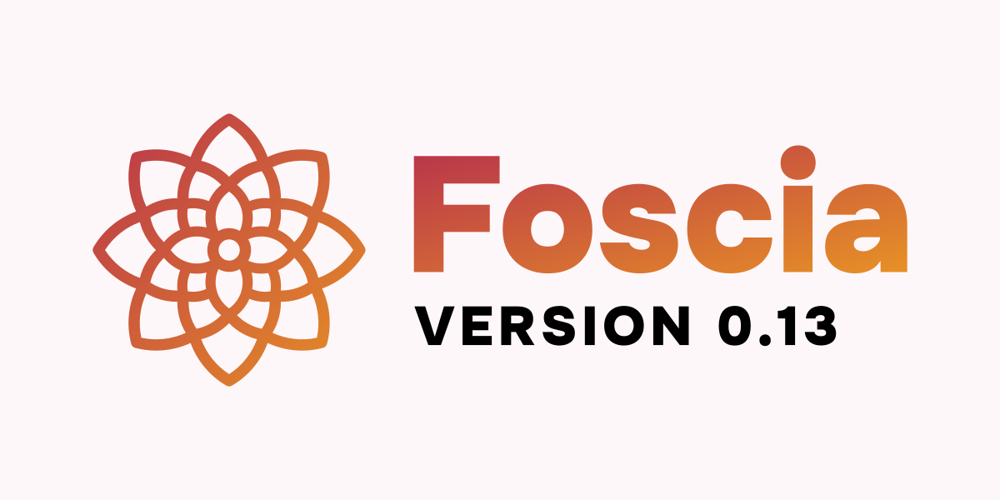

We are happy to announce **Foscia 0.13**.

This release provides many new features, such as a more stable public API,
relation inverse support, record deletion by ID, a new
`@foscia/test` package for unit testing, and many more.

<!-- truncate -->

## What's new?

### Public API stability

Foscia API is evolving continuously since its first release, that's why it does
not have a 1.0.0 release yet.

### Relation inverse

### Serialization rework

### Middlewares

### Unit tests package

### Other features

#### Record deletion by ID

#### Query as

## Migration guide

## Changelog
